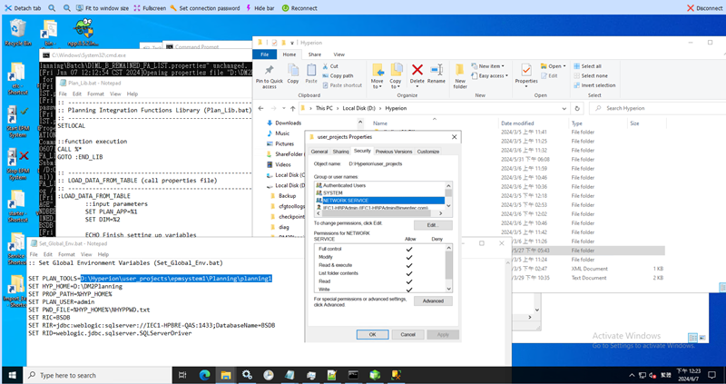

# SIT 测试记录

[[_TOC_]]

## SIT-056
**測試日期**: 2024-06-04  
![SIT-056][056-1]  
![SIT-056][056-2]  
![SIT-056][056-3]  
![SIT-056][056-4]  

**測試日期**: 2024-06-04
補歷史資料  
![SIT-056][056-5]  
![SIT-056][056-6]  

## SIT-055
**測試日期**: 2024-07-03  
![SIT-055][055-1]  
![SIT-055][055-2]  


## SIT-034
**測試日期**: 2024-06-06  
![SIT-034][034-1]

## SIT-041
**測試日期**: 2024-06-06  
### Issue-SIT-041
SIT-041, SIT-042 AP Server 無法正常產生Log

**測試日期**: 2024-06-07  

[Ref- Issue-SIT-041: AP Server 無法正常產生Log](#Issue-SIT-041)

**Issue**: AP Server 無法正常產生Log  
**Solution**: 添加 NETWORK SERVICE 權限  



#### 正常載入資料
![SIT-041][041-2]  
![SIT-041][041-3]  

**測試日期**: 2024-07-05  
![SIT-041][041-4]  
![SIT-041][041-5]  

## SIT-042
**測試日期**: 2024-06-07  

![SIT-042][042-1]  

**Issue**: Data Quality Not Accept  
**Reason**: 資料為測試資料, 需與SIT-041 FA list 相同, 才會建立  
![SIT-042][042-2]  

**測試日期**: 2024-07-05  
![SIT-042][042-3]  
![SIT-042][042-4]  

## SIT-043
**測試日期**: 2024-07-05  
![SIT-043][043-1]  
![SIT-043][043-2]  
`失敗  Member 2024-07-03 13:49:54 Not Found In Database`

**測試日期**: 2024-07-11
![SIT-043][043-3] 
![SIT-043][043-4] 

25筆缺少ENTITY
| Column  | value      | CNT | SOURCE           |
| ------- | ---------- | --- | ---------------- |
| ENTITY  | 5513CZ     | 1   | FA_AMOUNT_ACTUAL |
| ENTITY  | 5549CZ     | 17  | FA_AMOUNT_ACTUAL |
| ENTITY  | 55MCA9     | 5   | FA_AMOUNT_ACTUAL |
| ENTITY  | 55UD02     | 1   | FA_AMOUNT_ACTUAL |
| ENTITY  | 67MP89     | 1   | FA_AMOUNT_ACTUAL |
| CUSTOM2 | EBU5S24007 | 1   | FA_AMOUNT_ACTUAL |
| CUSTOM2 | EBU6D24005 | 1   | FA_AMOUNT_ACTUAL |
| CUSTOM2 | EQACN24005 | 1   | FA_AMOUNT_ACTUAL |
| CUSTOM2 | EQACN24006 | 1   | FA_AMOUNT_ACTUAL |

```SQL
SELECT ENTITY,COUNT(1) AS CNT ,'FA_AMOUNT_ROLLING' AS SOURCE
FROM [BSDB].[ODS].FA_AMOUNT_ROLLING
LEFT JOIN [BSDB].[dbo].V_IECPLN_ENTITY
ON ENTITY COLLATE Chinese_Taiwan_Stroke_CI_AS = MemberName
WHERE MemberName IS NULL
GROUP BY ENTITY
SELECT 'CUSTOM2' AS [COLUMN],CUSTOM2 AS [Value],COUNT(1) AS CNT ,'FA_AMOUNT_ACTUAL' AS SOURCE
  FROM [BSDB].[ODS].FA_AMOUNT_ACTUAL
left join [BSDB].[dbo].V_IECFA_CUSTOM2
on CUSTOM2 COLLATE Chinese_Taiwan_Stroke_CI_AS = MemberName
WHERE MemberName IS NULL
GROUP BY CUSTOM2
```

## SIT-045
**測試日期**: 2024-06-07  
測試Error Mail  
![SIT-045][045-1]  
![SIT-045][045-2]  

**測試日期**: 2024-07-05
> Batch 'D:\\DM2Essbase\\Batch\\DL_BR_FA_AMOUNT.bat' does not exists."  
![SIT-045][045-3]  

**測試日期**: 2024-07-11
![SIT-045][045-4]
![SIT-045][045-5]

## SIT-046
**測試日期**: 2024-07-05
> Batch 'D:\\DM2Essbase\\Batch\\DL_BR_NEWFA_WRITEOFF.bat' does not exists."  
![SIT-046][046-1]  
![SIT-046][046-2]  

**測試日期**: 2024-07-11
RowCnt:0
![SIT-046][046-3]  

## SIT-050
**測試日期**: 2024-06-07  

因尚未使用Mapping對照ENTITY未壓, 導致資料load err, 有寄信  
![SIT-050 Record][050-1]  
![SIT-050 Record][050-2]  

以ENTITY='67PAAA01', 先測試  
![SIT-050 Record][050-3]  
![SIT-050 Record][050-4]  
### Issue-SIT-050
資料源Entity有誤且有空值，部份資料無法load進系統

**測試日期**: 2024-07-05  
![SIT-050 Record][050-5]  
![SIT-050 Record][050-6]  

使用者偏好設定
| 維度     | 使用者變數名稱  | 所選的成員              |
| -------- | --------------- | ----------------------- |
| Scenario | BudgetScenario  | Budget                  |
| Years    | ActualYear      | FY24                    |
| Years    | BudgetYear      | FY25                    |
| Custom2  | NewFAItems      | FY25 New FA Budget      |
| Custom2  | RemainedFAItems | FY24 Remained FA Budget |
| Custom2  | OpenPRItems     | FY24 Open PR            |
| Custom2  | YearlyFAItems   | FY24 FA Budget No       |

**測試日期**: 2024-07-11 
![SIT-050 Record][050-7]  
![SIT-050 Record][050-8] 

| ENTITY | CNT | SOURCE          |
| ------ | --- | --------------- |
| 55UD02 | 2   | FA_INFO_ROLLING |
| 67MP89 | 1   | FA_INFO_ROLLING |
| 5549CZ | 34  | FA_INFO_ROLLING |
| 5513CZ | 1   | FA_INFO_ROLLING |
| 55MCA9 | 6   | FA_INFO_ROLLING |
```sql
SELECT ENTITY,COUNT(1) AS CNT ,'FA_INFO_ROLLING' AS SOURCE
FROM [BSDB].[ODS].FA_INFO_ROLLING
LEFT JOIN [BSDB].[dbo].V_IECPLN_ENTITY
ON ENTITY COLLATE Chinese_Taiwan_Stroke_CI_AS = MemberName
WHERE MemberName IS NULL
GROUP BY ENTITY
```
## SIT-029/030/031
**測試日期**: 2024-06-11  

**Issue**: 無法接收回傳值, 先改用err檔案判斷, 但因為Hyperion特殊狀況無法產生err, 故必須修改能接收回傳值  
**Solution**: 後續發現MAXL Shell 執行mxl檔案時, 有/b會導致Error, 移除/b可以正常接收回傳值  

![SIT-029 Record][029-1]

| Error: /b會導致Error     | Success                  |
| ------------------------ | ------------------------ |
| ![SIT-029 Record][029-2] | ![SIT-029 Record][029-3] |

## SIT-039
**測試日期**: 2024-06-13  
![SIT-039 Record][039-1]  
![SIT-039 Record][039-2]
![SIT-039 Record][039-3]  

## Issue-SIT-039  
資料源Account、Entity有誤，部份資料無法load進系統  

**測試日期**: 2024-06-19  
[Ref- Issue-SIT-039: Account問題](#Issue-SIT-039)  

**Solution**: 解決會科問題, SAP Controlling Area = CNCO 時, 費用會科前綴碼請使用 PD  

先排除不在系統的ENTITY測試  
![SIT-039 Record][039-4]  
![SIT-039 Record][039-5]  
![SIT-039 Record][039-6]  

**測試日期**: 2024-07-09
![SIT-039 Record][039-7]

## SIT-040
**測試日期**: 2024-06-13  
![SIT-040 Record][040-1]  
![SIT-040 Record][040-2]
![SIT-040 Record][040-3]  

## Issue-SIT-040  
資料源Account、Entity有誤，部份資料無法load進系統  

**測試日期**: 2024-06-19  
[Ref- Issue-SIT-040: Account問題](#Issue-SIT-040)  

**Solution**: 解決會科問題, SAP Controlling Area = CNCO 時, 費用會科前綴碼請使用 PD

先排除不在系統的ENTITY測試  
![SIT-040 Record][040-4]  
![SIT-040 Record][040-5]    

**測試日期**: 2024-07-09
![SIT-040 Record][040-6]

## SIT-054  
**測試日期**: 2024-06-13  
![SIT-054 Record][054-1]  
![SIT-054 Record][054-2]  
![SIT-054 Record][054-3]  
## Issue-SIT-054  
資料源Product有誤，缺少SITE專用代碼，CUSTOM 欄位錯誤

## SIT-038
**測試日期**: 2024-06-13  
![SIT-038 Record][038-1]  
![SIT-038 Record][038-2]  
![SIT-038 Record][038-3]  
## Issue-SIT-038  
資料源Entity有誤，部份資料無法load進系統

先排除不在系統的ENTITY測試  
## Issue-SIT-038-2
資料源ACCOUNT有誤 e.g.:CZ_55037  
![SIT-038 Record][038-4]  
![SIT-038 Record][038-5]  

```SQL
CREATE VIEW [ODS].[COST_CENTER_ACTUAL] AS 
WITH CombinedData AS (
SELECT * FROM STAGE.COST_CENTER_ACTUAL_ADJ_EBG
UNION ALL
SELECT * FROM STAGE.COST_CENTER_ACTUAL_ADJ_PSG
UNION ALL
SELECT A.DATA_YEAR AS [YEAR]
	,A.[PERIOD]
	,A.[SCENARIO]
	,A.[VERSION]
	,A.[DATA]
	,A.[CURRENCY]
	,A.[ACCOUNT]
	,A.[ENTITY]
	,A.[CUSTOMER]
	,A.[PRODUCT]
	,A.[PRODUCT_TYPE]
	,A.[SITE]
	,A.[CUSTOM1]
	,A.[CUSTOM2]
	,A.[CUSTOM3]
	,A.[AMOUNT]
	,A.CREATE_DATE
	,A.CREATOR
FROM [BSDB].[dbo].[ZCC_ACTUAL_RAW] AS A
LEFT JOIN (
SELECT DATA_YEAR
      ,[PERIOD]
      ,MAX(CAST([CREATE_DATE] AS DATE)) AS MAX_CREATE_DATE
  FROM [BSDB].[dbo].[ZCC_ACTUAL_RAW]
 GROUP BY DATA_YEAR, [PERIOD]) AS B
 ON A.DATA_YEAR=B.DATA_YEAR
 AND A.PERIOD=B.PERIOD
 AND CAST([CREATE_DATE] AS DATE)=MAX_CREATE_DATE
 WHERE B.DATA_YEAR IS NOT NULL
)
SELECT 
      [YEAR]
      ,[PERIOD]
      ,[SCENARIO]
      ,[VERSION]
      ,[DATA]
      ,[CURRENCY]
      ,[ACCOUNT]
      ,[ENTITY]
      ,[CUSTOMER]
      ,[PRODUCT]
      ,[PRODUCT_TYPE]
      ,[SITE]
      ,[CUSTOM1]
      ,[CUSTOM2]
      ,[CUSTOM3]
      ,SUM([AMOUNT]) AS [AMOUNT]
	  ,GETDATE() AS CREATE_DATE
FROM CombinedData
--LEFT JOIN  [BSDB].[dbo].V_IECFA_ENTITY AS B
--ON [ENTITY] COLLATE Chinese_Taiwan_Stroke_CI_AS =MemberName
--where MemberName is NOT null
GROUP BY 
      [YEAR]
      ,[PERIOD]
      ,[SCENARIO]
      ,[VERSION]
      ,[DATA]
      ,[CURRENCY]
      ,[ACCOUNT]
      ,[ENTITY]
      ,[CUSTOMER]
      ,[PRODUCT]
      ,[PRODUCT_TYPE]
      ,[SITE]
      ,[CUSTOM1]
      ,[CUSTOM2]
      ,[CUSTOM3];
GO

```

## SIT-051
![SIT-051 Record][051-1]  
## Issue-SIT-051  
- 資料源Entity、Custom2有誤，部份資料無法load進系統
- ADF SendEmail Error  

![SIT-051 Record][051-2]  
![SIT-051 Record][051-3]  

**測試日期**: 2024-07-05  
![SIT-051 Record][051-4]  

## SIT-052
**測試日期**: 2024-06-18  
![SIT-052 Record][052-1]  
![SIT-052 Record][052-2]  

**測試日期**: 2024-07-05
補歷史資料  
![SIT-052 Record][052-3]  
```sql
SELECT PERIOD,ENTITY,ACCOUNT,PNL_GL,AMOUNT
  FROM [BSDB].[ODS].[PNL_ACTUAL]
  LEFT JOIN [BSDB].[STAGE].[PNL_GL_ACCOUNT]
  ON ACCOUNT = PNL_GL_ACCOUNT
    where YEAR = 'FY24'
  AND ENTITY = 'EN00006'
```

## SIT-053
**測試日期**: 2024-06-18  

![SIT-053 Record][053-1]  
![SIT-053 Record][053-2]  
![SIT-053 Record][053-3]  
### Issue-SIT-053
資料Customer是空值，PROFUCT跟PRODUCT TYPE都押NA的，duplicate的 都是產品押OTHERS

**測試日期**: 2024-06-20  
[Ref- Issue-SIT-053: 修復資料](#Issue-SIT-053)

排除對不到PRODUCT 測試
``` SQL 
CREATE VIEW [ODS].[PRODUCT_SALES_PLAN_ACTUAL] AS 
WITH CombinedData AS (
SELECT * FROM (
SELECT * FROM [BSDB].STAGE.PRODUCT_SALES_PLAN_ACTUAL_EBG
UNION ALL
SELECT * FROM [BSDB].STAGE.PRODUCT_SALES_PLAN_ACTUAL_NBG
UNION ALL
SELECT * FROM [BSDB].STAGE.PRODUCT_SALES_PLAN_ACTUAL_PSG)A
LEFT JOIN [BSDB].[dbo].[V_IECPLN_PRODUCT] AS B
ON A.[PRODUCT] COLLATE Chinese_Taiwan_Stroke_CI_AS = MemberName
WHERE B.MemberName IS NOT NULL
)
SELECT [YEAR]
      ,[PERIOD]
      ,[SCENARIO]
      ,[VERSION]
      ,[DATA]
      ,[CURRENCY]
      ,[ACCOUNT]
      ,[ENTITY]
      ,[CUSTOMER]
      ,[PRODUCT]
      ,[PRODUCT_TYPE]
      ,[SITE]
      ,[CUSTOM1]
      ,[CUSTOM2]
      ,[CUSTOM3]
      ,[AMOUNT]
      ,[CREATE_DATE] FROM CombinedData
```
![SIT-053 Record][053-4]

## SIT-044

## Issue-SIT-044
PERIOD: 5 不符合系統
個位數月份前面填補0
ENTITY:
1. 沒有單位代號: ICC_  _55APU001
2. 沒有成本中心: ICC_01AW_

Period填補0測試  
``` sql
CREATE VIEW [ODS].[HEADCOUNT_ACTUAL] AS 
SELECT [YEAR]
      ,RIGHT('0' + CAST(PERIOD AS VARCHAR), 2) AS [PERIOD]
      ,[SCENARIO]
      ,[VERSION]
      ,[DATA]
      ,[CURRENCY]
      ,[ACCOUNT]
      ,[ENTITY]
      ,[SITE]
      ,[CUSTOM1]
      ,[CUSTOM2]
      ,[CUSTOM3]
      ,[AMOUNT]
      ,[CREATE_DATE] FROM STAGE.HEADCOUNT_ACTUAL
```
![SIT-044 Record][044-1]  
![SIT-044 Record][044-2]  
![SIT-044 Record][044-3]  
![SIT-044 Record][044-4]  

**測試日期**: 2024-07-11  

![SIT-044 Record][044-5]  
![SIT-044 Record][044-6]  

## SIT-057
**測試日期**: 2024-06-28

中文導致變成???
> Furugawa 古河電機
> 高通 SiMA Channel and others (牧德,銘異,ASE) E200
Member LEO TMY CHT oneweb Not Found In Database

![SIT-057 Record][057-1]
![SIT-057 Record][057-2]
![SIT-057 Record][057-3]

**測試日期**: 2024-07-02
有空白與系統不同導致無法Load
專案名稱:Darjeeling(Dove riser)_F-DARJEEL
Hyperion:Darjeeling(Doveriser)_F-DARJEEL

> Nydia: Checked with Yuting 說可以用空格. 是因為已經建在 Hyperion 的維度成員有人調整成沒有空格. 已請顧問改回 user 提供的有空格的 data  

專案名稱: 兩個空格修改成一個空格  
| No  | 問題              | 資料                 |
| --- | ----------------- | -------------------- |
| 1   | PRODUCT有兩個空白 | Baicells JP ISC  MIT |
| 2   | PRODUCT有兩個空白 | Comba  DL25          |
| 3   | PRODUCT有兩個空白 | Comba  DL35          |
| 4   | PRODUCT有兩個空白 | LIPS  F110           |

**測試日期**: 2024-07-03  
![SIT-057 Record][057-4]  
![SIT-057 Record][057-5]  
![SIT-057 Record][057-6]  

## SIT-047
**測試日期**: 2024-07-05
![SIT-047][047-1]  

**測試日期**: 2024-07-11  
![SIT-047][047-2]  
![SIT-047][047-3]  
| ENTITY | CNT | SOURCE          |
| ------ | --- | --------------- |
| 5549CZ | 4   | OPEN_PR_ROLLING |
| 55UD02 | 1   | OPEN_PR_ROLLING |
```SQL
SELECT ENTITY,COUNT(1) AS CNT ,'OPEN_PR_ROLLING' AS SOURCE
FROM [BSDB].[ODS].OPEN_PR_ROLLING
LEFT JOIN [BSDB].[dbo].V_IECFA_ENTITY
ON ENTITY COLLATE Chinese_Taiwan_Stroke_CI_AS = MemberName
WHERE MemberName IS NULL
GROUP BY ENTITY
```

## SIT-049
**測試日期**: 2024-07-05
![SIT-049][049-1]  
**測試日期**: 2024-07-11  
![SIT-049][049-2]  
![SIT-049][049-3]  
| ENTITY | CNT | SOURCE          |
| ------ | --- | --------------- |
| 5549CZ | 4   | OPEN_PR_ROLLING |
| 55UD02 | 1   | OPEN_PR_ROLLING |

## Restart OHS
![Restart OHS][restartOHS-1]
![Restart OHS][restartOHS]

## References
[restartOHS]: ./_assets/WindowsStartOHSserver.png
[restartOHS-1]: ./_assets/WindowsTaskScheduler.png
[034-1]: ./_assets/SIT-034_ADF_Manual_Trigger.png
[041-1]: ./_assets/Add_user_permission.png
[029-1]: ./_assets/SIT-029_Edit_xml_file.png
[029-2]: ./_assets/SIT-029_MAXL_Error.png
[029-3]: ./_assets/SIT-029_MAXL_Success_Return.png
[038-1]: ./_assets/SIT-038_Error.png
[038-2]: ./_assets/SIT-038_ADF_Error.png
[038-3]: ./_assets/SIT-038_Error_Mail_2.png
[038-4]: ./_assets/SIT-038_Error_2.png
[038-5]: ./_assets/SIT-038_Error_Mail.png
[039-1]: ./_assets/SIT-039_Error.png
[039-2]: ./_assets/SIT-039_ADF_Error.png
[039-3]: ./_assets/SIT-039_Error_Mail.png
[039-4]: ./_assets/SIT-039_Error_2.png
[039-5]: ./_assets/SIT-039_BS_DataLoad.png
[039-6]: ./_assets/SIT-039_BS_DataLoad_2.png
[039-7]: ./_assets/SIT-039_Lose_Member_1.png
[040-1]: ./_assets/SIT-040_Error.png
[040-2]: ./_assets/SIT-040_Error_Mail.png
[040-3]: ./_assets/SIT-040_Error_2.png
[040-4]: ./_assets/SIT-040_ADF_Error.png
[040-5]: ./_assets/SIT-040_BS_DataLoad.png
[040-6]: ./_assets/SIT-040_Lose_Member_1.png
[041-2]: ./_assets/SIT-041_ADF_Sucess.png
[041-3]: ./_assets/SIT-041_BS_DataLoad.png
[041-4]: ./_assets/SIT-041_BS_Log.png
[041-5]: ./_assets/SIT-041_BS_DataLoad_2.png
[044-1]: ./_assets/SIT-044_Error.png
[044-2]: ./_assets/SIT-044_ADF_Error.png
[044-3]: ./_assets/SIT-044_Error_Mail.png
[044-4]: ./_assets/SIT-044_BS_DataLoad.png
[042-1]: ./_assets/SIT-042_ADF_Sucess.png
[042-2]: ./_assets/SIT-042_BS_DataLoad_Quality_0.png
[042-3]: ./_assets/SIT-042_BS_Log.png
[042-4]: ./_assets/SIT-042_BS_DataLoad.png
[043-1]: ./_assets/SIT-043_ADF_Error.png
[043-2]: ./_assets/SIT-043_Error.png
[043-3]: ./_assets/SIT-043_BS_Log.png
[043-4]: ./_assets/SIT-043_BS_DataLoad.png
[045-1]: ./_assets/SIT-045_error.png
[045-2]: ./_assets/SIT-045_error_mail.png
[045-3]: ./_assets/SIT-045_Batch_Not_Found.png
[045-4]: ./_assets/SIT-045_BS_Log.png
[045-5]: ./_assets/SIT-045_BS_DataLoad.png
[046-1]: ./_assets/SIT-046_BS_Log.png
[046-2]: ./_assets/SIT-046_Batch_Not_Found.png
[046-3]: ./_assets/SIT-046_BS_Log_2.png
[047-1]: ./_assets/SIT-047_BS_Log.png
[047-2]: ./_assets/SIT-047_BS_Log_2.png
[047-3]: ./_assets/SIT-047_BS_DataLoad.png
[049-1]: ./_assets/SIT-049_BS_Log.png
[049-2]: ./_assets/SIT-049_BS_Log_2.png
[049-3]: ./_assets/SIT-049_BS_DataLoad.png
[050-1]: ./_assets/SIT-050_ADF_Error.png
[050-2]: ./_assets/SIT-050_Error_Mail.png
[050-3]: ./_assets/SIT-050_ADF_Sucess.png
[050-4]: ./_assets/SIT-050_BS_DataLoad.png
[050-5]: ./_assets/SIT-050_BS_Log.png
[050-6]: ./_assets/SIT-050_BS_DataLoad_2.png
[050-7]: ./_assets/SIT-050_BS_Log_1.png
[050-8]: ./_assets/SIT-050_BS_DataLoad_3.png
[051-1]: ./_assets/SIT-051_Error.png
[051-2]: ./_assets/SIT-051_ADF_Error.png
[051-3]: ./_assets/SIT-051_SendMail_Error.png
[051-4]: ./_assets/SIT-051_BS_Log.png
[052-1]: ./_assets/SIT-052_ADF_Sucess.png
[052-2]: ./_assets/SIT-052_BS_DataLoad.png
[052-3]: ./_assets/SIT-052_History_BS_DataLoad.png
[053-1]: ./_assets/SIT-053_Error.png
[053-2]: ./_assets/SIT-053_ADF_Error.png
[053-3]: ./_assets/SIT-053_Error_Mail.png
[053-4]: ./_assets/SIT-053_BS_DataLoad.png
[054-1]: ./_assets/SIT-054_Error.png
[054-2]: ./_assets/SIT-054_ADF_Error.png
[054-3]: ./_assets/SIT-054_Error_Mail.png
[055-1]: ./_assets/SIT-055_History_BS_Log.png
[055-2]: ./_assets/SIT-055_History_BS_DataLoad.png
[056-1]: ./_assets/SIT-056_ADF_Error.png
[056-2]: ./_assets/SIT-056_Error_Data.png
[056-3]: ./_assets/SIT-056_Error_Fail.png
[056-4]: ./_assets/SIT-056_Error_Mail.png
[056-5]: ./_assets/SIT-056_History_BS_Log.png
[056-6]: ./_assets/SIT-056_History_BS_DataLoad.png
[057-1]: ./_assets/SIT-057_ADF_Error.png
[057-2]: ./_assets/SIT-057_Error_Data.png 
[057-3]: ./_assets/SIT-057_Error_Mail.png 
[057-4]: ./_assets/SIT-057_ADF_Sucess.png
[057-5]: ./_assets/SIT-057_BS_DataLoad.png
[057-6]: ./_assets/SIT-057_Log.png